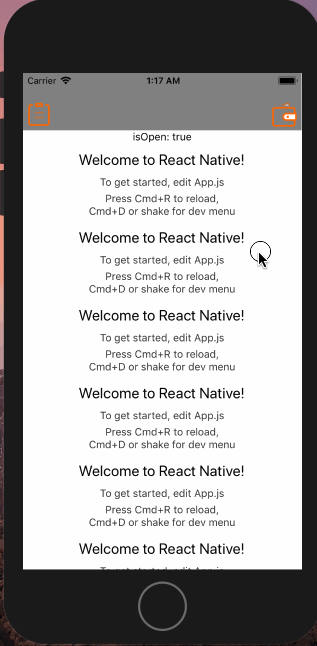
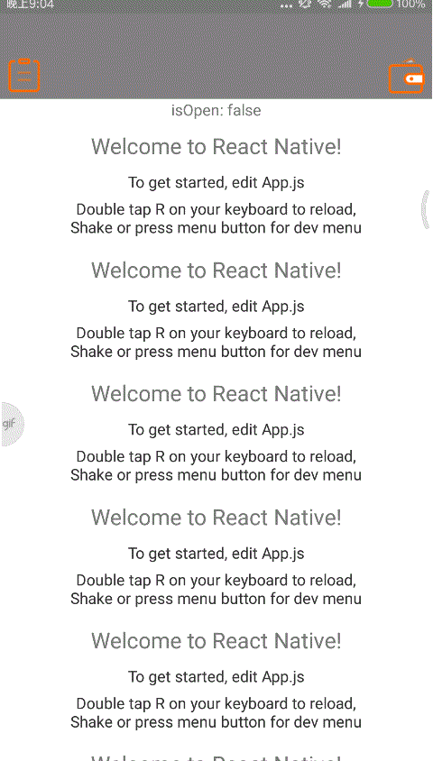

# react-native-ezsidemenu

[中文文档](./README_CN.md)

[![NPM version][npm-image]][npm-url]
[](https://github.com/easyui/react-native-ezsidemenu/releases)
[](https://raw.githubusercontent.com/joeferraro/react-native-ezsidemenu/master/LICENSE.md)

customizable side menu for React Native on iOS&android.


## Installation

```
$ npm install react-native-ezsidemenu --save
```

## Preview

### default type
  

### overlay type
  

### slide type
  

## Usage

import library：

```js
import EZSideMenu from 'react-native-ezsidemenu';
```

### simple

```js
//App.js
simpleMenu() {
    return <EZSideMenu
      menu={this.menu()}
      ref="menu">
      {this.contentView()}
    </EZSideMenu>
  }
```

### advanced

```js
//App.js
  advancedMenu() {
    const menuWidth = DEVICE_SCREEN.width * 0.8;
    const opacity = this.state.animation.interpolate({
      inputRange: [0, menuWidth],
      outputRange: [0, 1],
    });
    return <EZSideMenu
      onMenuStateChaned={(isOpen) => { this.setState({ isOpen }) }}
      onPanMove={(x) => { console.log('onPanMove ' + x) }}
      onSliding={(x, persent) => { console.log('onSliding x ' + x + ' persent ' + persent) }}
      type={EZSideMenu.type.Default}
      menuStyle={styles.container}
      shadowStyle={{ backgroundColor: 'rgba(20,20,20,.7)' }}
      direction={EZSideMenu.direction.Right}
      ref="menu"
      position={this.state.animation}
      width={menuWidth}
      menu={this.menu(opacity)}
      animationFunction={(prop, value) => Animated.spring(prop, {
        friction: 10,
        toValue: value
      })}>
      {this.contentView()}
    </EZSideMenu>
  }
```

## API

### Props

| key | type | default | description |                 
| --- | --- | --- | --- |
| menu | PropTypes.object.isRequired |  | menu component |
| shadowStyle | View.propTypes.style | { backgroundColor: 'rgba(0,0,0,.4)' } |  the style of the menu sahdow|
| menuStyle | View.propTypes.style | {} | the style of the menu  |
| direction | PropTypes.string | direction.Left | the direction of the menu |
| position | PropTypes.object | new Animated.Value(0) | the distance of the menu |
| width | PropTypes.number | DEVICE_SCREEN.width * 0.7 | the width of the menu |
| animationFunction | PropTypes.func | animationFunction: (prop, value) => Animated.timing(prop, { <br /> easing: Easing.inOut(Easing.ease), <br /> duration: 300, <br /> toValue: value <br /> }), | the animation of the menu |
| panGestureEnabled | PropTypes.bool | true | the menu can be move with gestures or not |
| panWidthFromEdge | PropTypes.number | 60 | edge distance on content view to open side menu |
| panTolerance | PropTypes.object | { x: 6, y: 20 } |  pan move tolerance |
| onPanMove | PropTypes.func | | callback on menu move |
| onSliding | PropTypes.func | | callback on menu is sliding | 
| onMenuStateChaned | PropTypes.func | | callback on menu state is chaned |
       

### Function
| function | description |                    
| --- | --- | 
| open() | open menu |
| close() | close menu |


## License
[MIT License](http://opensource.org/licenses/mit-license.html). © Zhu Yangjun 2017


[npm-image]: https://img.shields.io/npm/v/react-native-ezsidemenu.svg?style=flat-square
[npm-url]: https://npmjs.org/package/react-native-ezsidemenu
[travis-image]: https://img.shields.io/travis/yorkie/react-native-ezsidemenu.svg?style=flat-square
[travis-url]: https://travis-ci.org/yorkie/react-native-ezsidemenu
[david-image]: http://img.shields.io/david/yorkie/react-native-ezsidemenu.svg?style=flat-square
[david-url]: https://david-dm.org/yorkie/react-native-ezsidemenu
[downloads-image]: http://img.shields.io/npm/dm/react-native-ezsidemenu.svg?style=flat-square
[downloads-url]: https://npmjs.org/package/react-native-ezsidemenu
[React Native]: https://github.com/facebook/react-native
[react-native-cn]: https://github.com/reactnativecn
[react-native-ezsidemenu]: https://github.com/easyui/react-native-ezsidemenu
[Linking Libraries iOS Guidance]: https://developer.apple.com/library/ios/recipes/xcode_help-project_editor/Articles/AddingaLibrarytoaTarget.html


